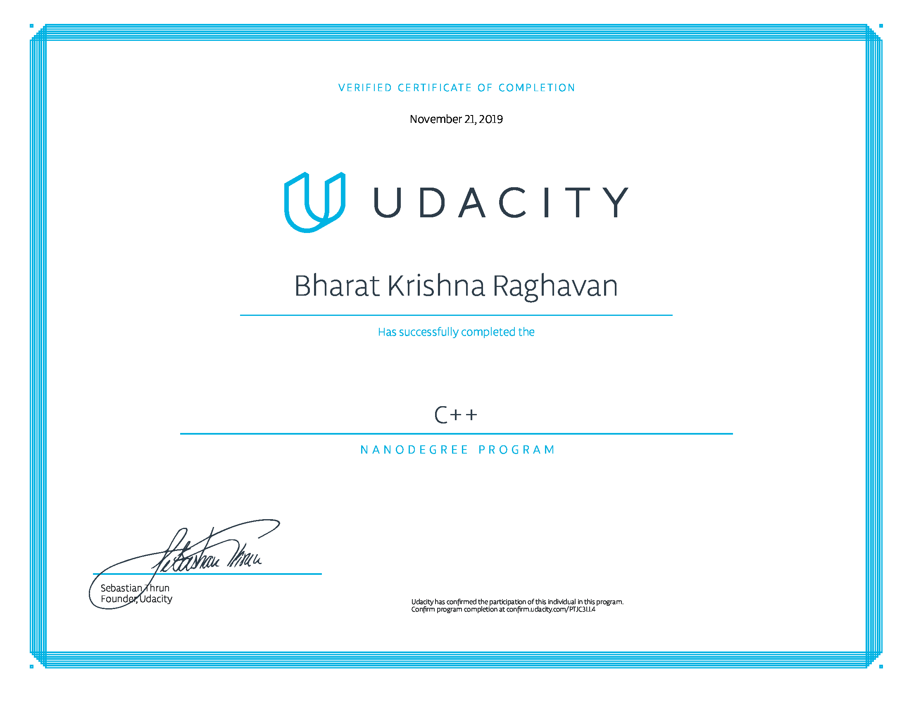

# C++ Developer Nanodegree

Certificate Confirmation: [https://confirm.udacity.com/PTJC3LL4](https://confirm.udacity.com/PTJC3LL4)

## Projects
### [OpenStreetMap Route Planner](https://github.com/bharatkrishna/CppND-Route-Planning-Project)

* Implemented A* Search for finding routes on street maps
* Test Driven Development using GTest

### [System Monitor](https://github.com/bharatkrishna/CppND-System-Monitor)
* An interactive Linux Symstem Monitor like [htop](https://hisham.hm/htop/)
* Used Objecet Orieted Programming concepts

### [Garbage Collector](https://github.com/bharatkrishna/CppND-Garbage-Collector)
* Implementation of 'Smart Pointer' for Garbage Collection

### [Concurrent Traffic Simulation](https://github.com/bharatkrishna/CppND-Program-a-Concurrent-Traffic-Simulation)
* Multithreaded traffic simulator using a real urban map
* Using latest C++11 concurrency techniques like async, future, etc. 

### Capstone Project: [Snake Game](https://github.com/bharatkrishna/CppND-Capstone-Snake-Game)
* Implementation of the classic Snake Game with a slightly different take, using SDL2 library
* Puts together all techniques from previous projects
